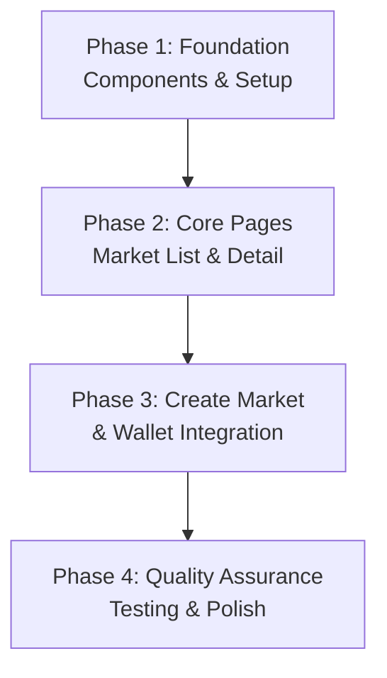
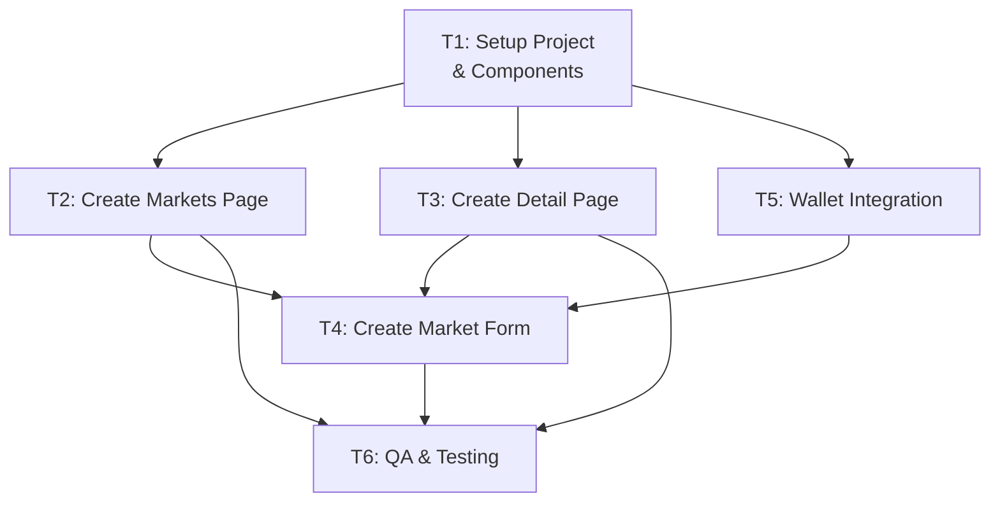

# Chausar Prediction Market UI - MVP Work Plan

**Status:** Pending
**Version:** 1.0
**Created:** January 20, 2026
**Owner:** Frontend Team

---

## 1. Overview

Build a simple, functional UI for Chausar prediction market MVP focusing ONLY on core user workflows. No portfolio pages, advanced charts, complex themes, or animations. Just make basic features work.

**Scope:** 4 simple pages, 4 basic components, minimal styling using existing Tailwind colors.

---

## 2. MVP Scope Definition

### Components (4 total)

1. **Button** - One style, basic padding/text, used everywhere
2. **Card** - Simple div wrapper with border/padding, holds content
3. **Input** - Basic text input field
4. **Badge** - Status labels (Open, Locked, Resolved)

### Pages (4 total)

1. **Home/Markets** - List of markets, simple table or grid
2. **Market Detail** - Show market, YES/NO prices, buy button
3. **Create Market** - Form to make a market
4. **Header** - Navigation, wallet connect button

### Colors from globals.css

- **YES:** Green (#22c55e via Tailwind green-500 or chart-4)
- **NO:** Red (#ef4444 via Tailwind red-500 or destructive)
- **Background:** White (--background)
- **Text:** Dark (--foreground)

---

## 3. Phase Structure



---

## 4. Task Dependency Diagram



---

## 5. Detailed Task Breakdown

### PHASE 1: Foundation Components and Setup

#### Task 1.1: Setup Project Structure and Basic Components

- **Description:** Create component directory structure and implement 4 basic components
- **What's Included:**
  - Create `/app/components/ui/` directory
  - Implement Button component (one style, tailwind classes)
  - Implement Card component (border wrapper)
  - Implement Input component (text field)
  - Implement Badge component (status labels)
  - All components should use existing Tailwind colors from globals.css
  - No external icon libraries (use text labels only)

- **Acceptance Criteria:**
  - All 4 components created and exportable
  - Button accepts text and onClick handler
  - Card accepts children
  - Input accepts placeholder and onChange
  - Badge accepts status prop and displays correct color (green for YES/Open, red for NO/Locked)
  - Components work in basic test page

- **Completion Verification (L1/L2/L3):**
  - L1: Components render without errors when imported
  - L2: No TS errors, components accept required props
  - L3: Build succeeds

- **Duration Estimate:** 2-3 hours

---

#### Task 1.2: Create Layout Components (Header and Basic Navigation)

- **Description:** Build header with wallet connect button (placeholder for now)
- **What's Included:**
  - Create Header component with logo/title
  - Add "Connect Wallet" button in header (non-functional for now)
  - Create simple nav structure
  - Use globals.css colors for background/text

- **Acceptance Criteria:**
  - Header appears on all pages
  - Header is sticky/fixed at top
  - Wallet button is visible and clickable (no functionality yet)
  - Uses existing theme colors

- **Completion Verification (L1/L2/L3):**
  - L1: Header displays on test page
  - L2: TypeScript types correct
  - L3: Build succeeds

- **Duration Estimate:** 1-2 hours

---

### PHASE 2: Core Pages - Market List and Market Detail

#### Task 2.1: Create Markets List Page

- **Description:** Build home page with table/grid of markets showing basic info
- **What's Included:**
  - Create `/app/markets/page.tsx`
  - Display markets in simple table format (5 columns: Question, YES %, NO %, Status, Action)
  - Mock data with 5 sample markets
  - Use Card component for each market row
  - Use Badge component for status
  - Link to detail page for each market
  - Simple "Create Market" button (link only, no functionality yet)

- **Mock Market Data Structure:**

  ```
  - Question (text)
  - YES price (%, e.g., 55%)
  - NO price (%, e.g., 45%)
  - Status (Open/Locked/Resolved)
  - Time remaining (text)
  - Link to /markets/[id]
  ```

- **Acceptance Criteria:**
  - Markets page loads and displays mock markets
  - YES price shown in green text
  - NO price shown in red text
  - Status badge shows correct color
  - Clicking market navigates to detail page
  - "Create Market" button is visible
  - Simple sorting by status works (Open first)

- **Completion Verification (L1/L2/L3):**
  - L1: Markets page renders with data
  - L2: No TS errors, onClick handlers work
  - L3: Build succeeds

- **Duration Estimate:** 3-4 hours

---

#### Task 2.2: Create Market Detail Page

- **Description:** Show single market with prices and simple buy button
- **What's Included:**
  - Create `/app/markets/[id]/page.tsx`
  - Display market question and description
  - Show YES and NO current prices (large text, colored)
  - Display pool reserves (YES liquidity, NO liquidity)
  - Show market status badge
  - Add simple "Buy YES" button (green)
  - Add simple "Buy NO" button (red)
  - Buttons are placeholder (no functionality yet)
  - Show basic market info (creator, end time)

- **Layout:**

  ```
  | Question                              |
  | Description here...                   |
  |---------------------------------------|
  | Status: [Badge]                       |
  | End time: Jan 25, 2026                |
  | Creator: 0x1234...                    |
  |---------------------------------------|
  | YES Price: 62%  [Green]               |
  | NO Price:  38%  [Red]                 |
  |---------------------------------------|
  | [Buy YES Button] [Buy NO Button]      |
  |---------------------------------------|
  | Pool Reserves:                        |
  | YES Pool: 1000 USDC, 1500 YES         |
  | NO Pool: 1500 USDC, 1000 NO           |
  ```

- **Acceptance Criteria:**
  - Detail page loads for valid market ID
  - All market info displays correctly
  - YES price shown in green
  - NO price shown in red
  - Buy buttons are visible and styled
  - Back button or link to markets list works
  - Page is readable on basic screen sizes

- **Completion Verification (L1/L2/L3):**
  - L1: Market detail page renders with mock data
  - L2: No TS errors, layout correct
  - L3: Build succeeds

- **Duration Estimate:** 3-4 hours

---

### PHASE 3: Create Market Form and Wallet Integration

#### Task 3.1: Create Market Form Page

- **Description:** Build form to create a new market (form only, no submission)
- **What's Included:**
  - Create `/app/create-market/page.tsx`
  - Form fields using Input components:
    - Question (required, textarea-like)
    - Description (optional, textarea-like)
    - End date (text input, format: YYYY-MM-DD)
    - Resolution date (text input, format: YYYY-MM-DD)
    - Initial liquidity (number input, USDC amount)
  - Basic validation message display (e.g., "End date must be in future")
  - Submit button (non-functional placeholder)
  - Cancel/back button

- **Form Validation (Client-side Display Only):**
  - End date must be in future
  - Resolution date must be after end date
  - Question required, min 10 chars
  - Initial liquidity >= 100 USDC

- **Acceptance Criteria:**
  - Form page loads with all fields visible
  - Input fields are usable and collect text
  - Validation messages appear as user types
  - Submit button is visible
  - Form uses Card component for container
  - Styling matches design (green for submit, red for cancel)

- **Completion Verification (L1/L2/L3):**
  - L1: Form renders with all fields
  - L2: No TS errors, onChange handlers work
  - L3: Build succeeds

- **Duration Estimate:** 3-4 hours

---

#### Task 3.2: Wallet Connection Setup

- **Description:** Integrate @solana/web3.js and wallet detection (UI only, no actual wallet connection)
- **What's Included:**
  - Install @solana/web3.js, @solana/wallet-adapter-react, @solana/wallet-adapter-phantom
  - Create wallet context/provider in providers.tsx (boilerplate)
  - Update "Connect Wallet" button to show placeholder text like "Connect (Devnet)"
  - Create mock wallet state (wallet connected/disconnected)
  - Show wallet address shortened in header when "connected" (mock)
  - Add disconnect button when wallet is "connected" (mock)

- **Acceptance Criteria:**
  - Wallet libraries installed and no build errors
  - Header shows "Connect Wallet" button initially
  - Clicking button shows mock connection status
  - UI shows mock wallet address when connected
  - Disconnect option appears when connected
  - No actual wallet transactions execute

- **Completion Verification (L1/L2/L3):**
  - L1: App loads with wallet button visible
  - L2: No TS errors, button click works
  - L3: Build succeeds

- **Duration Estimate:** 2-3 hours

---

### PHASE 4: Quality Assurance and Polish

#### Task 4.1: Test Component Functionality

- **Description:** Verify all components work correctly
- **What's Included:**
  - Test Button component on all pages (clicks, styling)
  - Test Card component displays content correctly
  - Test Input fields accept text
  - Test Badge shows correct colors for all statuses
  - Verify no broken links between pages
  - Verify form validation messages display
  - Check responsive layout (basic, not mobile-first)

- **Acceptance Criteria:**
  - All components render without errors
  - No console errors in browser
  - All page links work
  - Form validation displays correctly
  - Wallet mock connection works

- **Completion Verification (L1/L2/L3):**
  - L1: Manual testing on all pages
  - L2: No TypeScript errors
  - L3: Build succeeds

- **Duration Estimate:** 2-3 hours

---

#### Task 4.2: Basic Styling and Color Application

- **Description:** Ensure consistent use of colors from globals.css
- **What's Included:**
  - Verify YES elements use green (chart-4 or green-600)
  - Verify NO elements use red (destructive or red-600)
  - Verify buttons match color scheme
  - Verify text is readable on backgrounds
  - Remove any hardcoded colors, use Tailwind classes
  - Ensure consistent spacing using Tailwind (p-4, m-2, etc.)

- **Acceptance Criteria:**
  - All YES text/buttons are green
  - All NO text/buttons are red
  - Text contrast is readable
  - No hardcoded colors in code
  - Spacing is consistent

- **Completion Verification (L1/L2/L3):**
  - L1: Visual inspection passes
  - L2: CSS classes are correct
  - L3: Build succeeds

- **Duration Estimate:** 2 hours

---

#### Task 4.3: Build and Final Quality Check

- **Description:** Run build, check for errors, prepare for next phase
- **What's Included:**
  - Run `npm run build`
  - Check for any TypeScript errors
  - Run `npm run lint`
  - Fix any linting issues
  - Run `npm run format:check`
  - Verify no unused imports or variables
  - Test local dev server startup

- **Acceptance Criteria:**
  - Build succeeds with no errors
  - No TypeScript errors
  - Linting passes
  - Dev server starts without errors
  - All pages load in browser

- **Completion Verification (L1/L2/L3):**
  - L1: All pages load and render
  - L2: All build commands pass
  - L3: Ready for integration testing

- **Duration Estimate:** 1 hour

---

## 6. Component API Reference (Simple)

### Button

```tsx
<Button onClick={handleClick} variant="primary" disabled={false}>
  Click Me
</Button>

// Props:
// - onClick: (e: React.MouseEvent) => void
// - variant?: 'primary' | 'secondary' | 'danger' (default: primary)
// - disabled?: boolean
// - children: React.ReactNode
```

### Card

```tsx
<Card>
  <h2>Content here</h2>
</Card>

// Props:
// - children: React.ReactNode
// - className?: string (additional classes)
```

### Input

```tsx
<Input
  type="text"
  placeholder="Enter text..."
  value={value}
  onChange={(e) => setValue(e.target.value)}
/>

// Props:
// - type?: 'text' | 'number' | 'date' (default: text)
// - placeholder?: string
// - value: string
// - onChange: (e: React.ChangeEvent) => void
```

### Badge

```tsx
<Badge status="open">Open</Badge>
<Badge status="locked">Locked</Badge>
<Badge status="resolved">Resolved</Badge>

// Props:
// - status: 'open' | 'locked' | 'resolved'
// - children: string
```

---

## 7. Page Routes

| Route            | Component                   | Purpose                |
| ---------------- | --------------------------- | ---------------------- |
| `/`              | Home (redirect to /markets) | Entry point            |
| `/markets`       | MarketsList                 | View all markets       |
| `/markets/[id]`  | MarketDetail                | View single market     |
| `/create-market` | CreateMarket                | Create new market form |

---

## 8. Color Reference

From `/app/globals.css`:

- **Green (YES):** Use Tailwind `text-green-600` or CSS chart-4 color
- **Red (NO):** Use Tailwind `text-red-600` or CSS destructive color
- **Background:** White (`bg-white` or `bg-background`)
- **Text:** Dark (`text-foreground` or `text-gray-900`)
- **Border:** `border-border` from CSS variable

---

## 9. Development Checklist

### Phase 1

- [ ] Component directory created
- [ ] Button component implemented
- [ ] Card component implemented
- [ ] Input component implemented
- [ ] Badge component implemented
- [ ] Header component with nav
- [ ] Build passes

### Phase 2

- [ ] Markets list page shows mock data
- [ ] Markets list uses components
- [ ] Market detail page loads
- [ ] Market detail shows prices and buttons
- [ ] Navigation between pages works
- [ ] Build passes

### Phase 3

- [ ] Create market form page created
- [ ] Form fields accept input
- [ ] Form validation displays
- [ ] Wallet connection button added
- [ ] Mock wallet connection works
- [ ] Build passes

### Phase 4

- [ ] All components verified
- [ ] All links tested
- [ ] Colors applied correctly
- [ ] Build succeeds
- [ ] Lint passes
- [ ] Format check passes
- [ ] Dev server starts
- [ ] All pages load in browser

---

## 10. Key Decisions

1. **No Advanced Features:** Portfolio, charts, animations, dark mode - all excluded for MVP
2. **Mock Data Only:** No real contract calls, all data is hardcoded
3. **No Form Submission:** Forms collect input but don't submit
4. **No Wallet Functionality:** Wallet button shows state but doesn't connect to actual wallet
5. **Simple Styling:** Use existing Tailwind colors, no custom CSS beyond globals.css
6. **Single Button Style:** One button style used everywhere for simplicity
7. **Green/Red Only:** YES is green, NO is red, no other colors

---

## 11. Files to Create

```
app/
├── components/
│   ├── ui/
│   │   ├── Button.tsx
│   │   ├── Card.tsx
│   │   ├── Input.tsx
│   │   └── Badge.tsx
│   ├── Header.tsx
│   └── Layout.tsx
├── markets/
│   ├── page.tsx              (Market list)
│   └── [id]/
│       └── page.tsx          (Market detail)
├── create-market/
│   └── page.tsx              (Create market form)
└── page.tsx                  (Home, redirect to /markets)
```

---

## 12. Success Criteria for MVP

All of the following must be true to consider UI MVP complete:

- [ ] All 4 components created and working
- [ ] All 4 pages created and navigable
- [ ] Markets list displays mock data
- [ ] Market detail shows prices colored correctly
- [ ] Create market form displays all fields
- [ ] Header shows on all pages
- [ ] Wallet button is present in header
- [ ] No console errors
- [ ] TypeScript build succeeds
- [ ] Linting passes
- [ ] All links work
- [ ] Form validation displays

---

## 13. Risks and Mitigations

| Risk                                   | Impact | Likelihood | Mitigation                                        |
| -------------------------------------- | ------ | ---------- | ------------------------------------------------- |
| Tailwind color variables not available | High   | Low        | Check globals.css, use standard colors if needed  |
| Component prop types unclear           | Medium | Medium     | Define clear interfaces in components             |
| Page routing issues                    | Medium | Low        | Use Next.js App Router conventions                |
| TypeScript errors during build         | High   | Medium     | Fix types as we go, use `any` only as last resort |
| Wallet adapter incompatibility         | Medium | Medium     | Start with basic setup, defer complex setup       |

---

## 14. Notes

- Estimate total time: 20-25 hours (4-5 days for one developer)
- Focus on functional simplicity over visual polish
- All components use Tailwind CSS classes from globals.css
- Mock data is sufficient for MVP - no contract calls needed
- No testing framework required (manual testing only)
- Build must pass with no errors before considering phase complete

---

**Version:** 1.0
**Last Updated:** January 20, 2026
**Status:** Ready for Implementation
