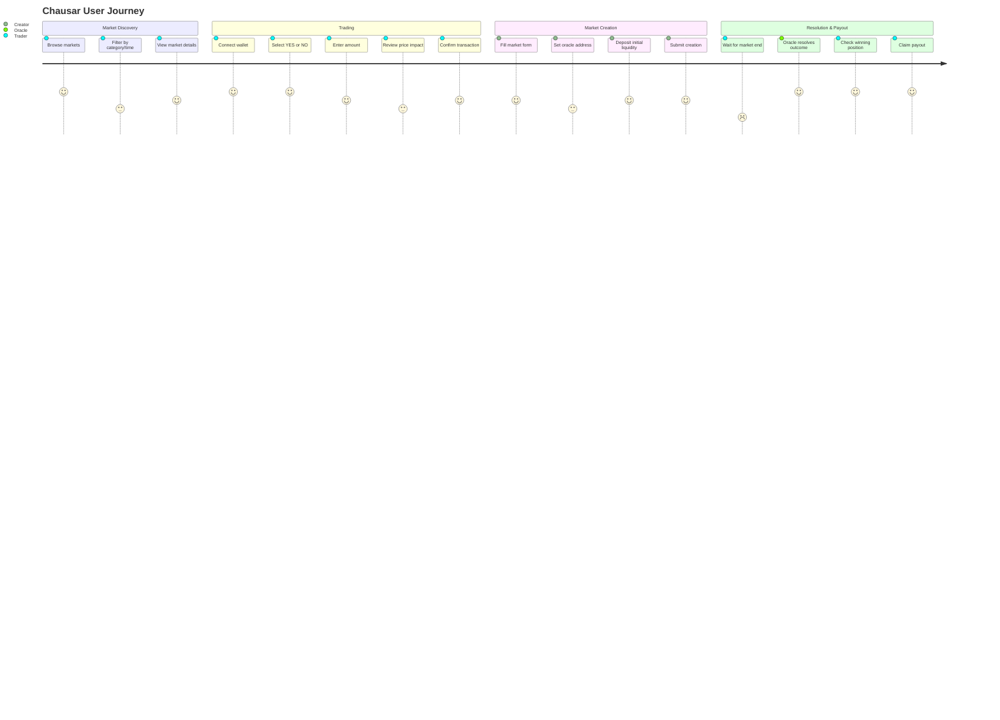
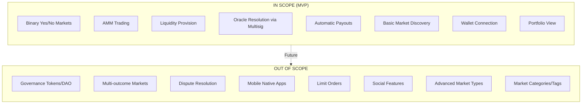

# PRD: Chausar - Solana Decentralized Prediction Market

## Overview

### One-line Summary
A trustless, permissionless prediction market on Solana where users can create binary (Yes/No) markets, trade positions via AMM, and receive automatic payouts based on oracle-resolved outcomes.

### Background
Current prediction markets either require custody of funds, impose KYC/geographical restrictions, or rely on centralized entities for settlement. Chausar addresses these pain points by leveraging Solana's high-speed, low-cost blockchain to provide a fully decentralized alternative where users maintain control of their funds, markets are transparent, and settlements are automatic via smart contracts.

**Core Value Proposition:**
- No custody - users control funds via wallet
- No KYC/geographical restrictions
- Automatic settlement via smart contracts
- Transparent, on-chain liquidity pools

## User Stories

### Primary Users

#### Persona 1: Market Creator
- Wants to create prediction markets on topics they care about
- Willing to provide initial liquidity
- Expects fair oracle resolution

#### Persona 2: Trader
- Wants to bet on outcomes
- Expects clear pricing and instant execution
- Wants to withdraw winnings without friction

#### Persona 3: Liquidity Provider
- Wants to earn fees from trading activity
- Willing to take on market-making risk
- Expects transparent LP token accounting

### User Stories

**Market Creator:**
```
As a Market Creator
I want to create a binary prediction market with initial liquidity
So that I can enable trading on topics I believe will attract interest
```

**Trader:**
```
As a Trader
I want to buy YES or NO tokens based on my prediction
So that I can profit if my prediction is correct
```

**Liquidity Provider:**
```
As a Liquidity Provider
I want to deposit funds into market pools
So that I can earn trading fees from market activity
```

### Use Cases

1. **Create Market**: User creates a market like "Will Bitcoin close above $100,000 on January 31, 2026?" with 500 USDC initial liquidity
2. **Trade Position**: User sees YES trading at 0.65 (65% probability) and buys 100 YES tokens for 65 USDC
3. **Provide Liquidity**: User adds 1000 USDC to the YES pool to earn 0.3% on all YES trades
4. **Claim Winnings**: After market resolves YES, holder of YES tokens claims 1 USDC per token

## User Journey Diagram



## Scope Boundary Diagram



## Functional Requirements

### Must Have (MVP)

- [ ] **Create Market**: Users can create binary prediction markets
  - AC: Given a connected wallet with 100+ USDC, when user submits valid market parameters (question, end time, resolve time, initial liquidity), then market account is created with YES/NO tokens and pools initialized

- [ ] **Trade YES/NO Tokens**: Users can trade positions via AMM
  - AC: Given an open market, when user specifies USDC amount and side (YES/NO), then tokens are transferred with slippage within 0.1% of quoted price

- [ ] **Add Liquidity**: Users can provide liquidity to pools
  - AC: Given an open market, when user deposits USDC to a pool, then LP tokens are minted proportionally to pool share

- [ ] **Remove Liquidity**: Users can withdraw liquidity
  - AC: Given LP token balance, when user burns LP tokens, then proportional USDC and position tokens are returned

- [ ] **Lock Market**: Markets are locked when end time is reached
  - AC: Given current time >= end_time, when anyone calls lock_market, then market status changes to Locked and trading is disabled

- [ ] **Resolve Market**: Oracle can set market outcome
  - AC: Given market status is Locked and caller is oracle, when resolve_market is called with result, then market status changes to Resolved

- [ ] **Claim Winnings**: Winners can claim payouts
  - AC: Given market is Resolved, when user holding winning tokens calls claim_winnings, then tokens are burned and 1 USDC per token is transferred

- [ ] **Market List Page**: Display all markets with search/filter
  - AC: Markets are listed with question, prices, time remaining, liquidity, and status; sortable by ending soon, volume, newest

- [ ] **Market Detail Page**: Full market information and trading interface
  - AC: Page shows question, description, price chart, trading interface with amount input and price impact display

- [ ] **Portfolio Page**: User position tracking
  - AC: Page displays active positions, LP positions, claimable winnings, and trade history

- [ ] **Create Market Page**: Market creation form
  - AC: Form accepts question, description, end time, resolve time, initial liquidity, and oracle selection

- [ ] **Wallet Connection**: Support major Solana wallets
  - AC: Users can connect via Phantom and Solflare; wallet state persists across sessions

### Should Have

- [ ] **Price Charts**: Historical price visualization
  - AC: Market detail page shows YES/NO price history over time

- [ ] **Transaction History**: Trade activity feed
  - AC: Market page shows recent trades with timestamp, side, amount

- [ ] **Slippage Protection**: User-configurable slippage tolerance
  - AC: Default 5% slippage; user can adjust; trade rejected if slippage exceeded

- [ ] **Market Search/Filter**: Advanced discovery features
  - AC: Users can search by keyword and filter by status/time

### Could Have (Post-MVP)

- [ ] **Market Categories/Tags**: Organized market browsing
- [ ] **Share Market Links**: Social sharing capability
- [ ] **Email Notifications**: Resolution alerts
- [ ] **Advanced Charts**: Technical analysis tools

### Won't Have (Out of Scope)

- **Governance Tokens/DAO**: No protocol governance in MVP
- **Multi-outcome Markets**: Only binary Yes/No supported
- **Dispute Resolution**: Oracle decision is final in MVP
- **Mobile Native Apps**: Web only
- **Limit Orders**: AMM only, no orderbook
- **Social Features**: No comments, profiles, following
- **Advanced Market Types**: No scalar or categorical markets

## Non-Functional Requirements

### Performance
- **Response Time**: Page load < 2 seconds; transaction confirmation < 1 second (Solana block time)
- **Throughput**: Support 100+ concurrent users
- **Transaction Cost**: < $0.01 per trade

### Reliability
- **Availability**: 99.9% uptime (dependent on Solana network)
- **Error Rate**: < 1% transaction failure rate
- **Retry Logic**: Automatic retry on network congestion

### Security
- **Access Control**: Only oracle can resolve markets; only LP token holders can remove liquidity
- **Validation**: All timestamps validated; slippage checks on trades; prevent double-resolution
- **Economic Security**: Minimum 100 USDC liquidity; maximum 5% default slippage

### Scalability
- **Market Capacity**: Unlimited markets (each is independent account)
- **User Capacity**: No limit on concurrent users (constrained by Solana network)

## Technical Specifications

### Technology Stack

**Blockchain:**
- Solana mainnet
- Anchor framework for smart contracts

**Smart Contracts:**
- Rust/Anchor program for core logic
- SPL Token program for YES/NO tokens

**Frontend:**
- React 19 + TypeScript
- @solana/kit - Core Solana primitives
- @solana/client - RPC client
- @solana/react-hooks - React wallet connection with auto-discovery
- Tailwind CSS v4
- Codama-generated TypeScript client from Anchor IDL

**Backend (Optional for MVP):**
- Simple indexer for market discovery
- Could be replaced by on-chain queries initially

### On-Chain Architecture

```
+-------------------------------------------+
|         Prediction Protocol               |
|          (Anchor Program)                 |
+-------------------------------------------+
              |
              +-- Market Accounts
              +-- Pool Accounts (YES/NO)
              +-- Vault Accounts (USDC)
              +-- Oracle Account
```

### Core Data Models

**Market Account:**
```rust
pub struct Market {
    pub id: u64,                    // Unique market ID
    pub question: String,           // Max 280 chars
    pub description: String,        // Max 1000 chars
    pub creator: Pubkey,            // Market creator
    pub oracle: Pubkey,             // Resolution authority

    pub end_time: i64,              // Unix timestamp - trading ends
    pub resolve_time: i64,          // Expected resolution time

    pub yes_mint: Pubkey,           // YES token mint
    pub no_mint: Pubkey,            // NO token mint

    pub yes_pool: Pubkey,           // YES AMM pool
    pub no_pool: Pubkey,            // NO AMM pool

    pub vault_usdc: Pubkey,         // USDC vault

    pub status: MarketStatus,       // Open | Locked | Resolved
    pub result: MarketResult,       // Undecided | Yes | No

    pub total_liquidity: u64,       // Total USDC locked
    pub created_at: i64,            // Creation timestamp
}

pub enum MarketStatus {
    Open,       // Trading active
    Locked,     // Trading ended, awaiting resolution
    Resolved,   // Outcome determined
}

pub enum MarketResult {
    Undecided,
    Yes,
    No,
}
```

**Pool Account:**
```rust
pub struct Pool {
    pub market: Pubkey,             // Parent market
    pub side: PoolSide,             // Yes or No

    pub usdc_reserve: u64,          // USDC in pool
    pub token_reserve: u64,         // YES/NO tokens in pool

    pub lp_mint: Pubkey,            // LP token mint
    pub total_lp_supply: u64,       // Total LP tokens

    pub fee_bps: u16,               // Fee in basis points (e.g., 30 = 0.3%)
    pub collected_fees: u64,        // Accumulated fees
}

pub enum PoolSide {
    Yes,
    No,
}
```

### AMM Pricing Model

Use **constant product formula** for each pool independently:

```
x * y = k

where:
x = USDC reserve
y = Token reserve (YES or NO)
k = constant
```

**Price calculation:**
```
Price of YES = USDC_yes / (USDC_yes + USDC_no)
Price of NO = USDC_no / (USDC_yes + USDC_no)

Always: Price_yes + Price_no = 1.0
```

**Token output calculation:**
```
Given USDC input (dx):
dy = (y * dx) / (x + dx)

where:
dy = tokens out
y = current token reserve
x = current USDC reserve
dx = USDC input
```

**Fee structure:**
- Trading fee: 0.3% (30 bps)
- Fees accrue to liquidity providers
- Deducted from input amount before swap calculation

### Smart Contract Instructions

| Instruction | Parameters | Access Control |
|-------------|------------|----------------|
| `create_market` | question, description, end_time, resolve_time, initial_liquidity | Any user with sufficient USDC |
| `trade` | side (Yes/No), amount_in, min_amount_out | Any user, market must be Open |
| `add_liquidity` | side, usdc_amount | Any user, market must be Open |
| `remove_liquidity` | side, lp_amount | LP token holder |
| `lock_market` | - | Anyone, when end_time reached |
| `resolve_market` | result (Yes/No) | Oracle only |
| `claim_winnings` | - | Winning token holder |

## Success Criteria

### Quantitative Metrics

**MVP Success (30 days post-launch):**
| Metric | Target | Measurement Method |
|--------|--------|-------------------|
| Markets Created | 50+ | On-chain count |
| Trades Executed | 500+ | On-chain count |
| Total Value Locked | $10,000+ | Sum of vault balances |
| Transaction Failure Rate | < 1% | Failed / Total transactions |
| Active Liquidity Providers | 10+ | Unique LP token holders |

**Growth Metrics (3 months):**
| Metric | Target | Measurement Method |
|--------|--------|-------------------|
| Markets Created | 500+ | On-chain count |
| Unique Wallets | 5,000+ | Unique signers |
| Total Value Locked | $100,000+ | Sum of vault balances |
| Daily Active Users | 50+ | Unique daily transactions |

### Qualitative Metrics

1. **User Experience**: Users can complete full flow (create market -> trade -> claim) without support
2. **Trust**: No security incidents or fund losses
3. **Reliability**: Consistent transaction success across varying network conditions

## Technical Considerations

### Dependencies
- Solana mainnet availability and performance
- Anchor framework for smart contract development
- SPL Token program for token management
- Wallet adapter compatibility (Phantom, Solflare)

### Constraints
- Solana transaction size limits
- Maximum slippage tolerance for large trades
- Oracle multisig availability for resolution

### Assumptions
- Solana mainnet maintains < 1 second block times
- USDC availability on Solana
- Users have basic wallet operation knowledge
- Oracle multisig members are available for timely resolution

### Risks and Mitigation

| Risk | Impact | Probability | Mitigation |
|------|--------|-------------|------------|
| Oracle manipulation | High | Medium | Use 3-of-5 multisig, plan dispute mechanism for v2 |
| Low liquidity kills markets | High | High | Set minimum liquidity requirement (100 USDC), incentivize LPs |
| Smart contract bug | Critical | Low | Audit, testnet testing, start with low limits |
| Poor UX -> no adoption | High | Medium | User testing, clear error messages, tutorials |
| Solana network congestion | Medium | Low | Implement retry logic, show clear pending states |

## Testing Requirements

### Smart Contract Tests

**Unit Tests:**
- Market creation
- Pool initialization
- AMM calculations
- Token minting/burning
- Access control

**Integration Tests:**
- Full trade flow
- Liquidity provision and removal
- Resolution and payout
- Edge cases (zero liquidity, dust amounts)

**Scenario Tests:**
- Multiple traders in same market
- LP providing then removing liquidity
- Market that resolves YES vs NO
- Expired market cannot be traded

### Frontend Tests

**Component Tests:**
- Form validation
- Wallet connection
- Transaction signing
- Error handling

**E2E Tests:**
- Create market -> Trade -> Resolve -> Claim
- Add liquidity -> Remove liquidity

## Undetermined Items

*No undetermined items - all questions resolved:*

1. **Oracle design**: Multisig for MVP, integrate Chainlink in v2
2. **Market creation fee**: Minimum liquidity only (100 USDC)
3. **Invalid markets**: Oracle can resolve as "Invalid" and return funds proportionally (post-MVP)
4. **Time zones**: UTC for all timestamps, display in user's local time in UI

## Appendix

### Example Markets

1. "Will Bitcoin close above $100,000 on January 31, 2026?"
2. "Will it rain in San Francisco on February 14, 2026?"
3. "Will the S&P 500 be above 6,000 on March 1, 2026?"

### Glossary

- **AMM**: Automated Market Maker - algorithm for token swaps
- **LP**: Liquidity Provider - user who deposits to pools
- **Oracle**: Trusted entity that resolves market outcomes
- **SPL**: Solana Program Library - token standard
- **TVL**: Total Value Locked - sum of all USDC in protocol
- **bps**: Basis points - 1/100th of a percent (100 bps = 1%)

### References

- Solana documentation: https://docs.solana.com
- Anchor framework: https://www.anchor-lang.com
- Kalshi (inspiration): https://kalshi.com
- Polymarket (comparison): https://polymarket.com

---

**Document Version:** 2.0
**Last Updated:** January 16, 2026
**Owner:** Development Team
**Status:** Accepted
